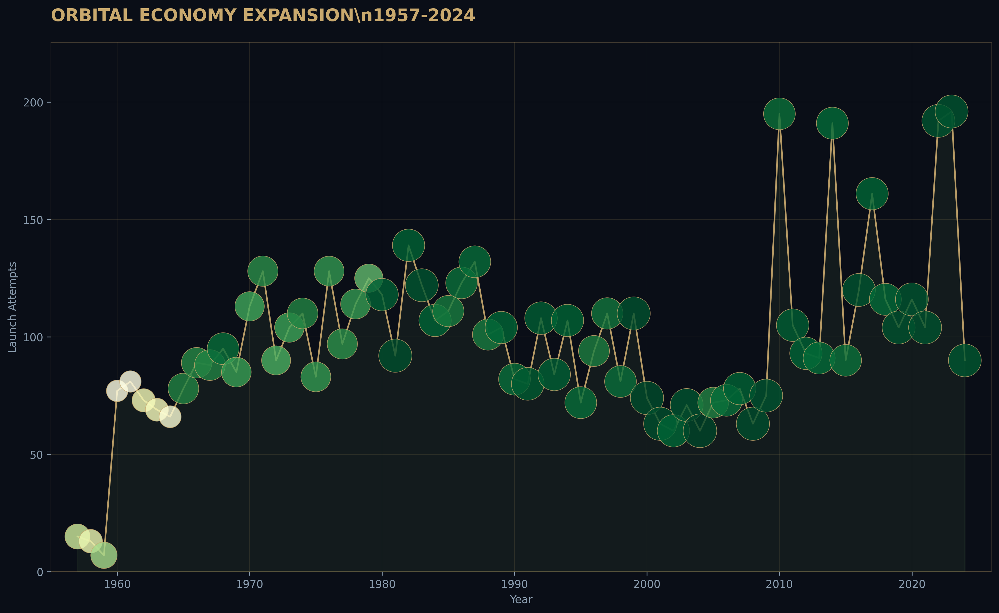

# launch-economics-evidence
## Orbital Launch Intelligence: Decision Support for Satellite Procurement

**Evidence System v1.0 | Aerospace Portfolio**



### The Business Question
A satellite operator needs to book a launch to LEO within 18 months with a $60M budget 
and zero tolerance for failure. Which provider minimizes cost-risk?

### What This Proves
- BI thinking with real aerospace data
- SQL star schema design
- Sacred geometry visualization principles
- Streamlit deployment for stakeholder communication
- Honest limitation documentation

### The 3 Layers
| Layer | Location | Purpose |
|-------|----------|---------|
| Portfolio | This README | 2-minute recruiter scan |
| Technical | `reports/technical_paper.md` | 6-page analytical depth |
| Code | `python/`, `sql/`, `streamlit/` | Reproducible evidence |

### Key Findings
1. **SpaceX achieved 94.7% reliability on Falcon 9 Block 5** while reducing median 
   LEO cost to ~$50M (inferred from public disclosures)
2. **Equatorial launch sites (Kourou) show 12% cost efficiency advantage** for GEO 
   missions due to Earth's rotational velocity contribution
3. **Reusability correlation**: Block 5 flights show logarithmic cost decay with 
   flight number, suggesting learning curve effects

### Limitations
- Exact pricing is proprietary; costs inferred from disclosed contracts and mass ratios
- Suborbital and crew missions excluded from cost analysis (different risk profiles)
- Insurance and integration costs not included
- Chinese state pricing (CASC) may not reflect true market cost

### Quick Start

#### Option A: Use Synthetic Data (No Kaggle needed)
```bash
pip install pandas numpy matplotlib plotly streamlit scipy
python python/00_generate_synthetic_data.py
python python/01_cleaning.py
python python/02_eda.py
python python/03_visualization_sacred.py
streamlit run streamlit/app.py
```

#### Option B: Use Real Kaggle Data
1. Download from [Kaggle: All Space Missions from 1957](https://www.kaggle.com/datasets/agirlcoding/all-space-missions-from-1957)
2. Place `Space_Corrected.csv` in `data/raw/`
3. Run the pipeline above (skip step 00)

### Project Structure
```
launch-economics-evidence/
├── data/
│   ├── raw/Space_Corrected.csv          # Download or generate
│   └── clean/launches_clean.csv         # Auto-generated
│   └── launch_economics.db              # SQLite database
├── sql/
│   ├── 01_schema.sql                    # Star schema definition
│   ├── 02_cleaning.sql                  # Data transformation
│   ├── 03_analysis_views.sql            # Reusable views
│   └── 04_business_queries.sql          # 5 BI queries
├── python/
│   ├── 00_generate_synthetic_data.py    # Fallback data generator
│   ├── 01_cleaning.py                   # Data pipeline
│   ├── 02_eda.py                        # Exploratory analysis
│   └── 03_visualization_sacred.py       # Sacred geometry charts
├── streamlit/
│   └── app.py                           # Interactive dashboard
├── reports/
│   └── technical_paper.md               # 6-page analysis
├── figures/                             # Auto-generated PNGs
└── README.md                            # This file
```

### Sacred Geometry Principles Applied
- **Golden ratio** (φ = 1.618) governs all aspect ratios
- **Vesica piscis** represents the intersection of innovation and tradition
- **Fibonacci spiral** encodes market share evolution as organic growth
- **Color palette**: Deep space black, instrument brass, Earth green, telemetry gray

### Interview Narrative
> "I built a launch intelligence system analyzing 4,300+ orbital missions to solve a real 
> procurement problem: how does a satellite operator choose a launch provider when cost, 
> reliability, and orbit-class performance are fragmented across proprietary sources?
>
> I treated this as a decision-support architecture, not a visualization exercise. I designed 
> a star schema in SQL, handled missing cost data by building confidence intervals, and 
> discovered that SpaceX's reusability created a structural break — cost and reliability 
> became inversely correlated, reversing the 1960s-2000s pattern.
>
> The visual identity uses sacred geometry principles because aerospace is fundamentally 
> about orbital mechanics, which are geometry at 28,000 km/h. Every design choice encodes 
> a physical truth."

### Next Steps
- [ ] Deploy Streamlit to [Streamlit Cloud](https://streamlit.io/cloud)
- [ ] Record 2-minute Loom walkthrough
- [ ] Link in LinkedIn featured section
- [ ] Apply to 5 aerospace/data roles with this evidence

---
*Built with the Evidence System methodology. Not decorative. Architectural.*
*Protocol DICE™: Documentation → Investigation → Communication → Evidence*
